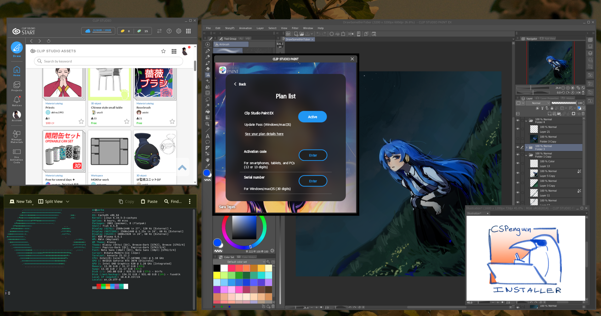

**CSPenguin-Installer** is an install script and patch set for CLIP STUDIO PAINT. It fixes the **asset store, login panels, file thumbnails, and timelapse/animation export** all while being very easy to install.

The current project is **functional** but in testing! The script is tested throughly in **CachyOS + KDE**, I'll find time to to test on other distros as soon as I survival my semester! I would really appreciate people testing it on other distros and reporting any issues they find!

Supports CSP 4.x & 5.x at the moment.


## Requirements

- A **Vulkan-capable GPU**
- A little bit of patience

Everything else (Wine, Winetricks, GStreamer plugins) is detected and installed automatically by the script.

## Install

One-liner via curl:

```bash
curl -fsSL https://raw.githubusercontent.com/parka6060/CSPenguin-Installer/main/install.sh | bash
```

Or clone the repo via:

```bash
git clone https://github.com/parka6060/CSPenguin-Installer.git
cd CSPenguin-Installer
./install.sh
```

The script downloads CSP and WebView2, sets up a Wine prefix, installs dependencies, applies patches, and creates desktop entries. You'll walk through the CSP installer when it pops up and pick a version (5.0.1 or 4.1.0) You can also bring your own installer via link or file.

## What gets installed

1. Wine 10.20 (bundled, portable) at `~/.local/share/cspenguin/wine-10.20/`
2. Wine prefix at `~/.wine-csp`
3. Corefonts, vcrun2022, and dotnet48 as runtime dependencies
4. DXVK + VKD3D
5. WebView2 Runtime (standalone installer)
6. dcomp.dll, a DirectComposition shim so WebView2 panels render correctly
7. mfplat/mfreadwrite/winegstreamer patches for timelapse/video export
8. `.clip` file thumbnails via a native thumbnailer binary
9. `.clip` file association so double-clicking opens CSP
10. KDE window rules (KDE only) so ribbon bar dropdowns appear on top of CSP instead of behind it. If this doesn't apply properly you can right click your CSP icon in your taskbar or set up window rules yourself!
11. A wineserver pre-warm service so CSP launches a bit faster


## Known issues!!
- Timelapse should work 100%, but animation export at non-default framerates could break encoding; not thoroughly tested.
- The timelapse patch DLLs are built against the bundled Wine version 10.20. Trying to use them elsewhere is not recommended.
- The installer can take a while, especially if downloading dotnet files.
- The first launch of CSP will be slow. Restarting your PC helps with subsequent launches!

## Support
This project is my gift to the community. If you have problems feel free to open an issue, or get in touch with me. But please do not expect me to fix installs on a case by case basis. 

## Uninstall

```bash
curl -fsSL https://raw.githubusercontent.com/parka6060/CSPenguin-Installer/main/uninstall.sh | bash
```

Or if you cloned the repo:

```bash
./uninstall.sh
```
___

Brought to you by https://eninabox.art/

Maybe I'll go use krita instead...